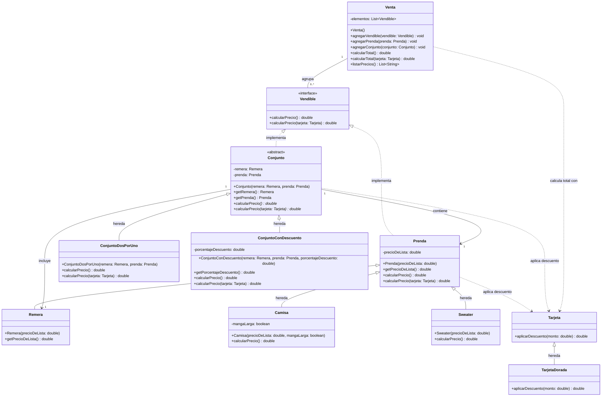

```mermaid
classDiagram
    direction TB

    class Vendible {
        <<interface>>
        +calcularPrecio() double
        +calcularPrecio(tarjeta: Tarjeta) double
    }

    class Prenda {
        -precioDeLista: double
        +Prenda(precioDeLista: double)
        +getPrecioDeLista() double
        +calcularPrecio() double
        +calcularPrecio(tarjeta: Tarjeta) double
    }

    class Remera {
        +Remera(precioDeLista: double)
        +getPrecioDeLista() double
    }

    class Camisa {
        -mangaLarga: boolean
        +Camisa(precioDeLista: double, mangaLarga: boolean)
        +calcularPrecio() double
    }

    class Sweater {
        +Sweater(precioDeLista: double)
        +calcularPrecio() double
    }

    class Conjunto {
        <<abstract>>
        -remera: Remera
        -prenda: Prenda
        +Conjunto(remera: Remera, prenda: Prenda)
        +getRemera() Remera
        +getPrenda() Prenda
        +calcularPrecio()* double
        +calcularPrecio(tarjeta: Tarjeta)* double
    }

    class ConjuntoDosPorUno {
        +ConjuntoDosPorUno(remera: Remera, prenda: Prenda)
        +calcularPrecio() double
        +calcularPrecio(tarjeta: Tarjeta) double
    }

    class ConjuntoConDescuento {
        -porcentajeDescuento: double
        +ConjuntoConDescuento(remera: Remera, prenda: Prenda, porcentajeDescuento: double)
        +getPorcentajeDescuento() double
        +calcularPrecio() double
        +calcularPrecio(tarjeta: Tarjeta) double
    }

    class Tarjeta {
        +aplicarDescuento(monto: double) double
    }

    class TarjetaDorada {
        +aplicarDescuento(monto: double) double
    }

    class Venta {
        -elementos: List~Vendible~
        +Venta()
        +agregarVendible(vendible: Vendible) void
        +agregarPrenda(prenda: Prenda) void
        +agregarConjunto(conjunto: Conjunto) void
        +calcularTotal() double
        +calcularTotal(tarjeta: Tarjeta) double
        +listarPrecios() List~String~
    }

%% Implementacion de interfaces
    Vendible <|.. Prenda : implementa
    Vendible <|.. Conjunto : implementa

%% Herencia de prendas
    Prenda <|-- Remera : hereda
    Prenda <|-- Camisa : hereda
    Prenda <|-- Sweater : hereda

%% Herencia de conjuntos
    Conjunto <|-- ConjuntoDosPorUno : hereda
    Conjunto <|-- ConjuntoConDescuento : hereda

%% Herencia de tarjetas
    Tarjeta <|-- TarjetaDorada : hereda

%% Relaciones entre conjuntos y prendas
    Conjunto "1" --> "1" Remera : incluye
    Conjunto "1" --> "1" Prenda : contiene

%% Relacion entre venta y vendibles
Venta "1" -- "0..*" Vendible : agrupa

%% Dependencias con tarjetas
Prenda ..> Tarjeta : aplica descuento
Conjunto ..> Tarjeta : aplica descuento
Venta ..> Tarjeta : calcula total con
```