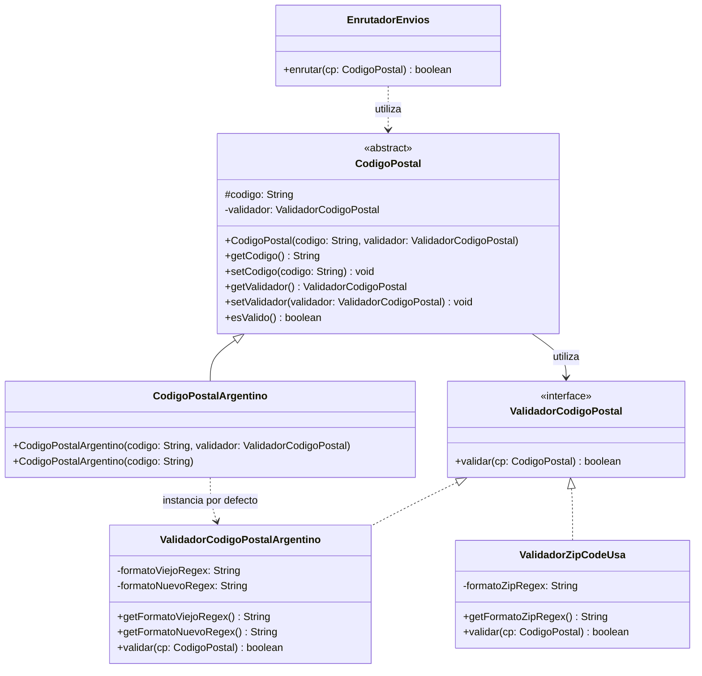

```mermaid
classDiagram
direction TB

class CodigoPostal {
<<abstract>>
#codigo: String
-validador: ValidadorCodigoPostal
+CodigoPostal(codigo: String, validador: ValidadorCodigoPostal)
+getCodigo() String
+setCodigo(codigo: String) void
+getValidador() ValidadorCodigoPostal
+setValidador(validador: ValidadorCodigoPostal) void
+esValido() boolean
}

class CodigoPostalArgentino {
+CodigoPostalArgentino(codigo: String, validador: ValidadorCodigoPostal)
+CodigoPostalArgentino(codigo: String)
}

class ValidadorCodigoPostal {
<<interface>>
+validar(cp: CodigoPostal) boolean
}

class ValidadorCodigoPostalArgentino {
-formatoViejoRegex: String
-formatoNuevoRegex: String
+getFormatoViejoRegex() String
+getFormatoNuevoRegex() String
+validar(cp: CodigoPostal) boolean
}

class ValidadorZipCodeUsa {
-formatoZipRegex: String
+getFormatoZipRegex() String
+validar(cp: CodigoPostal) boolean
}

class EnrutadorEnvios {
+enrutar(cp: CodigoPostal) boolean
}

CodigoPostal <|-- CodigoPostalArgentino

ValidadorCodigoPostal <|.. ValidadorCodigoPostalArgentino
ValidadorCodigoPostal <|.. ValidadorZipCodeUsa

CodigoPostal --> ValidadorCodigoPostal : utiliza

CodigoPostalArgentino ..> ValidadorCodigoPostalArgentino : instancia por defecto

EnrutadorEnvios ..> CodigoPostal : utiliza
```